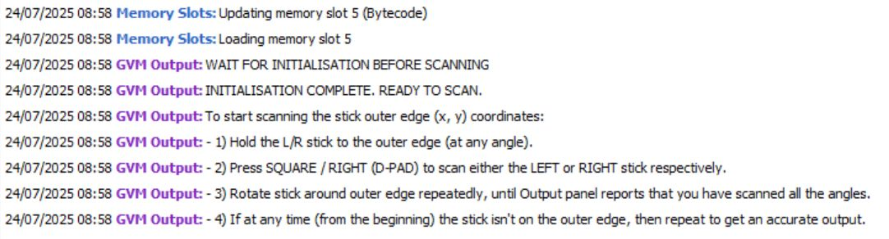
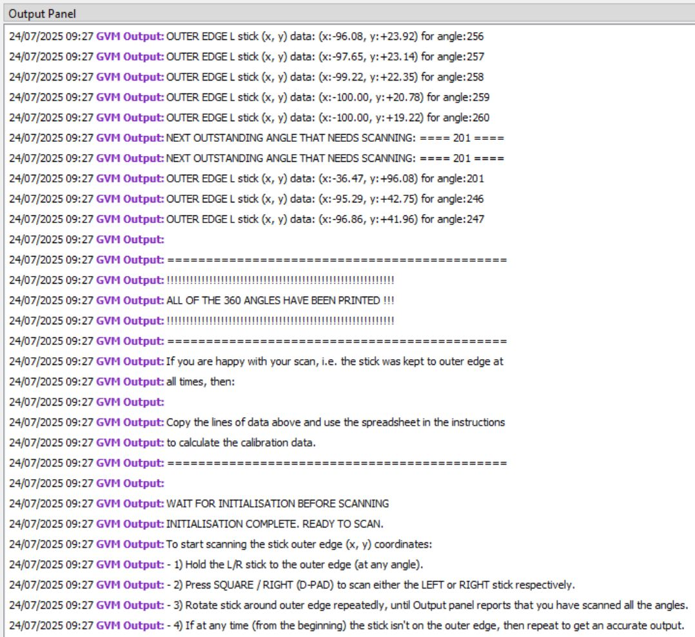
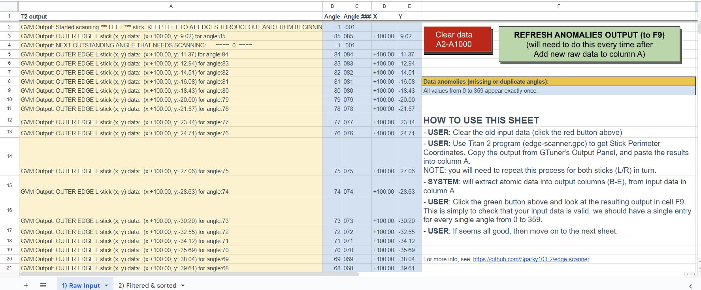
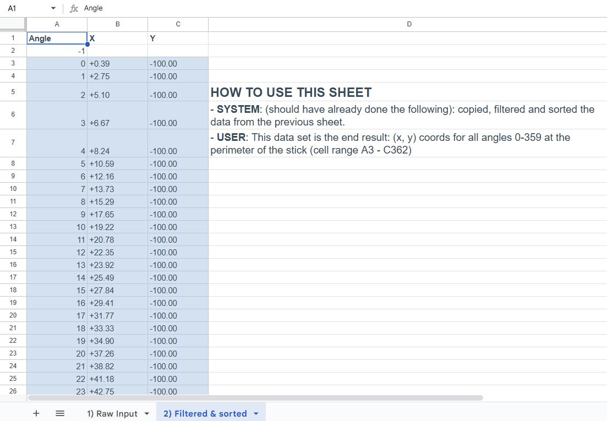

# edge-scanner - a tool for the Titan 2 - gets stick perimeter coordinates by stick angle

## What is it

This utility maps out the (x, y) coordinates for every angle from 0° to 359° along the outer edge of a controller stick. Perfect for calibration, visualization, or edge detection tasks.

This utility was created to support the development of [autorun360](https://github.com/Sparky101-2/autorun360), a Titan 2 application that provides a 360° autorun feature for fixed-view games like Diablo IV.

## How to use

### Prepare Gtuner settings

By default GTuner has a limited number of lines it can output to the Output panel.

How to enable more output lines in Gtuner IV

1. Make a backup copy of your Gtuner.cfg file.

1. Open your Gtuner.cfg file in a plain text editor like Notepad.

1. Find the [Environment] section.

1. Add the following line directly underneath [Environment] so it looks like this:

```
    [Environment]
    outputpanel_maxrows = 1024
```

5. Restart Gtuner (before the change to be enabled).

### Get raw data from Titan 2 script

1. Ensure Titan 2 device is connected to the GTuner app.
1. Ensure you can see the Output Panel (in Gtuner).
1. Copy the gpc script to the T2 (via Gtuner).
1. Load the gpc script in Gtuner (right click it and select 'Load Memory Slot').
1. Notice the Output Panel's output, and follow the instructions:


1. Perform a scan for either left or right stick until output panel reports scan is completed, like so:

1. Copy all the text from the output panel. We will use this text the next step with the spreadsheet to filter, extract and order the data...

### Filter, extract and order data in a spreadsheet

Use the spreadsheet to filter, extract and order the data (copied from the previous step).

#### Screenshots of the spreadsheet




#### Option 1 - Google Sheets spreadsheet

(Best and easiest option) Use this Google Sheets spreadsheet (you may need to make a copy of it on your Google account though along with any script): [edge-scanner filters, extracts and orders data from T2 output](https://docs.google.com/spreadsheets/d/1CsB0jAaaW8pJ_7zQ1Y-QHibpWUCN6WUxPK3ycMx6onM/edit?usp=sharing).

#### Option 2 - Use copy of spreadsheet

If the Google Sheets online spreadsheet is not available (for whatever reason) then I have included a converted copy of it, along with a copy of the script functions.

You should be able to use the XLXS document as an input source so you can recreate the Google Sheets document and then use the provided scripts ('Apps Script') in that sheet.

Resources:

- the xlsx doc is [here](assets/Google_Sheets_copy/edge-scanner_filters,_extracts_and_orders_data_from_T2_output.xlsx).

- script code is [here](assets/Google_Sheets_copy/apps_script_copy.txt).

#### Option 3 - Do it manually ;)

## Final thoughts

Beyond its core functionality, I chose to share this project due to the unique development challenges posed by Titan Two’s limitations.
Notably, several functions required frame-splitting (i.e. distributing logic across main{} iterations) to ensure proper execution.

Appreciate you checking this out — if it helped, feel free to leave a comment!

## Keywords (for search matching)

Titan 2, Titan2, Titan Two, TitanTwo, gpc, script, console, psn, ps4, ps5, ps6, playstation, xbox

auto run, autorun, 360, peripheral, periphery, outer edge, outer limit, scan, calibration, calibrated, calibrate
